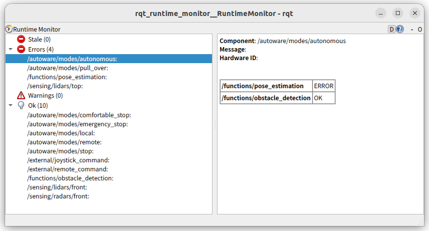

# Converter tool

This tool converts `/diagnostics_graph` to `/diagnostics_array` so it can be read by tools such as `rqt_runtime_monitor`.

## Usage

```bash
ros2 launch autoware_diagnostic_graph_utils converter.launch.xml
```

Use the launch file rather than `ros2 run`: it preloads the Agnocast heaphook, which the node needs to publish when built with `ENABLE_AGNOCAST=1`.

## Examples

Terminal 1:

```bash
ros2 launch diagnostic_graph_aggregator example-main.launch.xml
```

Terminal 2:

```bash
ros2 launch autoware_diagnostic_graph_utils converter.launch.xml
```

Terminal 3:

```bash
ros2 run rqt_runtime_monitor rqt_runtime_monitor --ros-args -r diagnostics:=diagnostics_array
```


