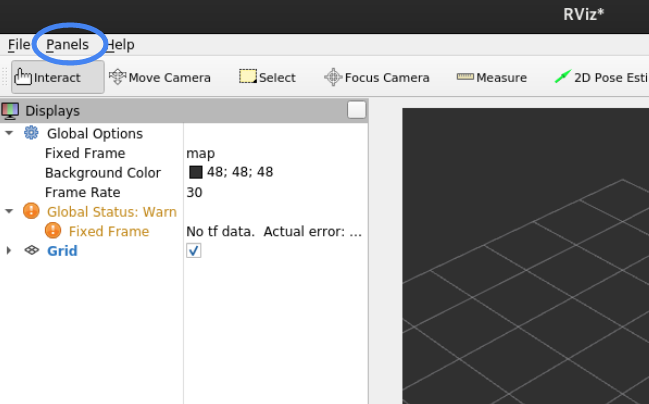
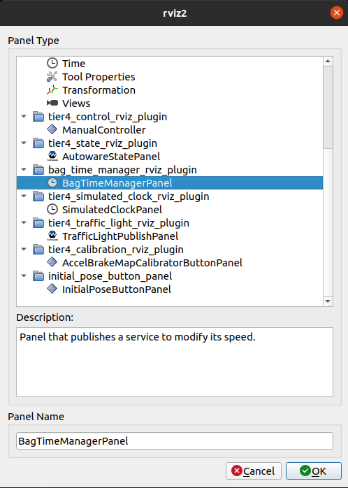
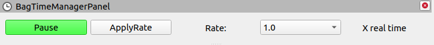

# autoware_bag_time_manager_rviz_plugin

## Purpose

This plugin allows publishing and controlling the ros bag time.

## Output

tbd.

## HowToUse

1. Start rviz and select panels/Add new panel.

   

2. Select BagTimeManagerPanel and press OK.

   

3. See bag_time_manager_rviz_plugin/BagTimeManagerPanel is added.

   

- Browse File...: pick a rosbag storage file (`.db3` or `.mcap`) to play.
- Browse Folder...: pick a rosbag folder (containing `metadata.yaml`) to play.
- Start/End sliders: trim playback to a sub-range of the bag. Both sliders are populated from the
  bag's duration (`ros2 bag info`) as soon as a path is selected, span the full bag by default, and
  cannot be dragged past each other. The start slider is passed to `ros2 bag play` as
  `--start-offset`. The end slider has no equivalent CLI flag on this ROS distro, so the panel
  enforces it itself: it watches the `/clock` topic and stops the player once elapsed time reaches
  the trimmed end — this requires `Publish /clock` to be enabled, otherwise the end trim is skipped
  (with a warning) and playback runs to the end of the bag. The elapsed/remaining label (below)
  reflects the trimmed window, not the whole bag.
- Publish /clock (checkbox + Hz field): when checked, playback publishes `/clock` at the given
  frequency (default 200 Hz) so downstream nodes using sim time stay in sync with the bag.
- Play: start `ros2 bag play` on the selected path, replacing any rosbag2 player process the
  panel already started.
- Stop: terminate the running rosbag2 player process.
- Elapsed/remaining time label: shows playback progress once a bag with `Publish /clock` enabled
  is playing. Total duration and the bag start time come from `ros2 bag info`; elapsed time comes
  from the `/clock` topic. Without `Publish /clock`, only the total duration is shown.
- Pause/Resume: pause/resume the clock.
- ApplyRate: apply rate of the clock.
- Route status label: shows whether a route has been captured (from `/planning/mission_planning/route`)
  or loaded from a file, and is ready to save/publish.
- Save Route...: serialize the captured/loaded route message to a file for later reuse.
- Load Route...: read a route file previously written by Save Route... back into memory.
- Publish Route: (re-)publish the captured/loaded route on `/planning/mission_planning/route`, with
  the same transient-local QoS the mission planner uses, so downstream planning nodes started
  afterwards still receive it.

The panel subscribes to `/planning/mission_planning/route` as soon as it initializes, using
`QoS(1).transient_local()` to match the mission planner's publisher — this captures the route
whether it was published before or after the panel was added, and does not require replaying a bag.
The most recently captured or loaded route is what Save Route... and Publish Route act on.
